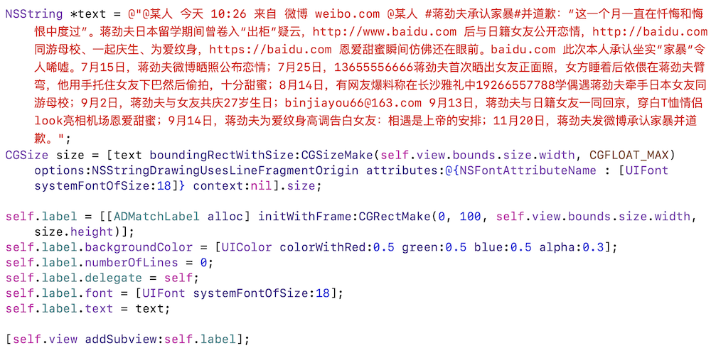
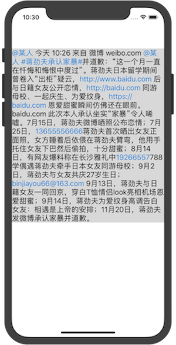
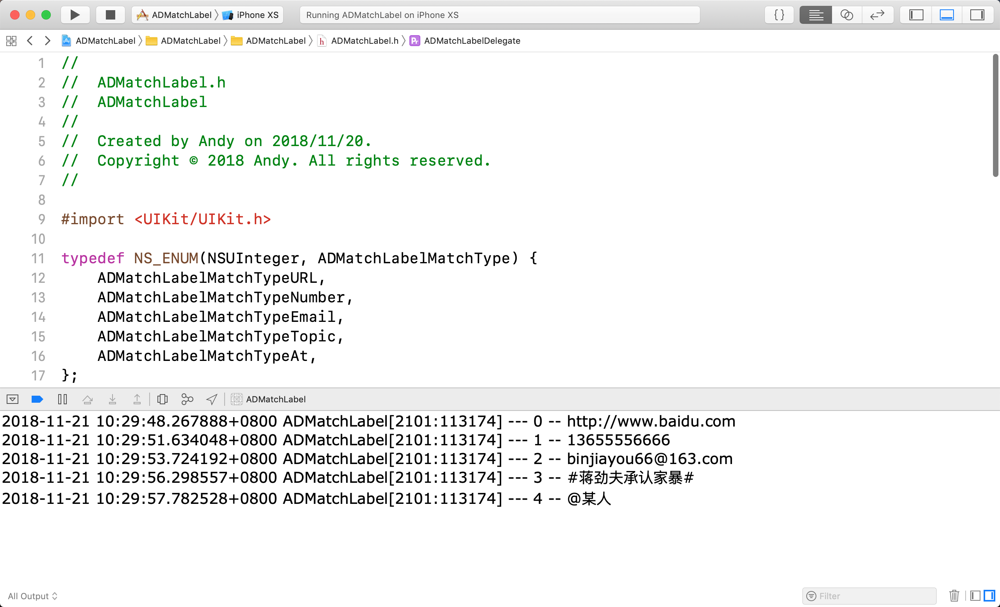

# ADMatchLabel
### [Summary]: match label. it can match url, number, email, topic and so on.

### [Keywords]: Match Label, Link Label, TextKit, URL/Number/Email/Topic


## 1.用法

### （1）集成

​	[方法1]. pod 'ADMatchLabel'

​	[方法2]. 可以直接将ADMatchLabel.h/.m文件拷贝至项目即可

### （2）代码



### （3）效果图



### (4)说明

a. 匹配类型支持。目前该Label支持链接、数字、邮箱、话题和艾特某人的匹配，这些匹配是可以通过**ADMatchLabel.h**文件的**matchTypes**数组对象进行配置的。假设只希望匹配链接和数字，可以通过以下代码实现：

```objective-c
self.label.matchTypes = @[@(ADMatchLabelMatchTypeURL), @(ADMatchLabelMatchTypeNumber)];
```

b.用户交互。当用户触摸到匹配文字区域时，触摸事件会通过代理的形式通知代理对象。如果开发者希望捕获用户触摸操作，实现代理方法即可，代理方法参数有匹配类型和匹配文本内容。代理方法和触发效果如下：

```objective-c
@protocol ADMatchLabelDelegate <NSObject>

- (void)linkLabelDidSelectedType:(ADMatchLabelMatchType)type content:(NSString *)content;

@end
```



c.匹配文本颜色。开发者可以通过**ADMatchLabel.h**文件的**matchColor**对象进行配置。假设开发者希望匹配到的文本颜色为红色，可以通过以下代码实现：

```objective-c
self.label.matchColor = [UIColor redColor];
```

## 2.结尾

### （1）目前该库能够支持公司业务需求，所以有一些功能还没配置齐全，如Block形式支持触摸回调、不同匹配类型配置不同文本颜色、Label文本的一些属性重写 （阴影、对齐、高亮和禁用等），等有机会的时候再进行完善吧。如果有特殊需要，可以开一个issue、pull request进行交流。

### （2）水平有限，个人思路具有片面性，如果有Bug出现，可以联系我。

### （3）如果喜欢，可以star支持一下。 : ) 

